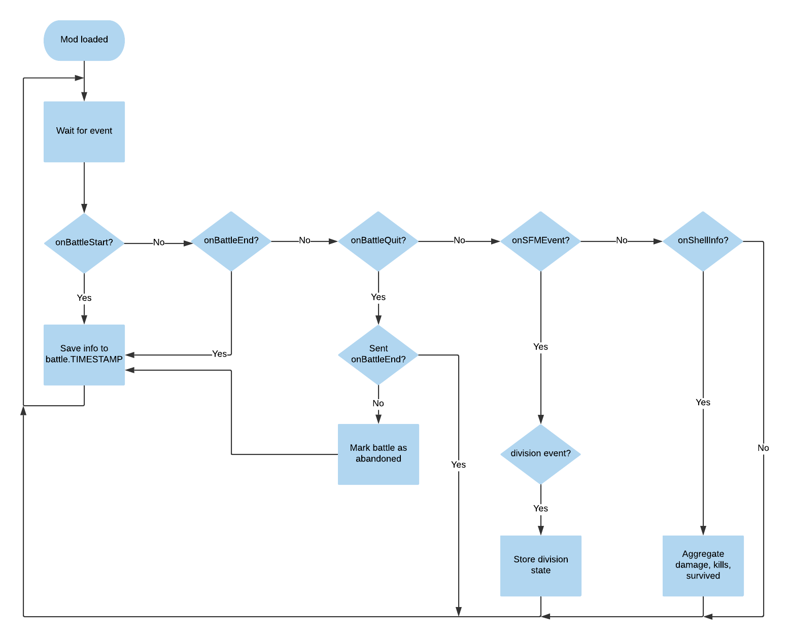

# StHub

The supertest hub, `StHub`, is a tool that allows members of the World of Warships super test program to track their statistics of testships, as they do not appear in official statistics.
The `StHub` requires a mod to be installed to the game to collect the battle information.

## Features

### Tracking Testship Games

By default, Testships do not appear on official World of Warships statistics. The supertest hub installs a modification to your game that tracks battles you play in test ships and records basic battle information about them.

### Tracking Division Stats

The supertest hub allows you to track how many games you have played in testships while being in a division and without a division.

### Tracking Average Testship Statistics

In addition to tracking each individual battle, the supertest hub allows you to see average statistics of your testships to better understand how you perform in a ship.

## Data Privacy

First and foremost, **battle data does not leave your computer**. The frontend is hosted on the internet but can only communicate with the `StHub` running locally on your machine.
The only reason that the frontend is hosted on the internet is to allow the mod creators to provide more frequent updates and bugfixes.

By nature of connecting to a website on the internet, the following data may be transmitted but will not be stored longer than 24 hours:

* IP address of your computer: Server access logs
* User Agent of your browser: Server access logs

## Development

### Architecture

#### st-hub (main)

The server exposes a locally running REST API on http://localhost:1323. It serves for both the frontend and the
`scraper`.

#### scraper (lib/scraper/)

The scraper component is built due to limitations in how the ModAPI works for World of Warships. By default, it is
not allowed to make requests on a localhost machine. This bug has been reported to Wargaming and will be fixed in "the next couple of updates", but in the meantime the scraper works by listening to changes on the `$GAME_CLIENT/res_mods/$GAME_VERSION/PnFMods/StHub/api` directory.

#### game modification (mod/)

The game modification gets re-installed everytime the `st-hub` main component is started. The purpose of the game
mod is to react to in-game events such as division enter/leave notifications and battle information.

